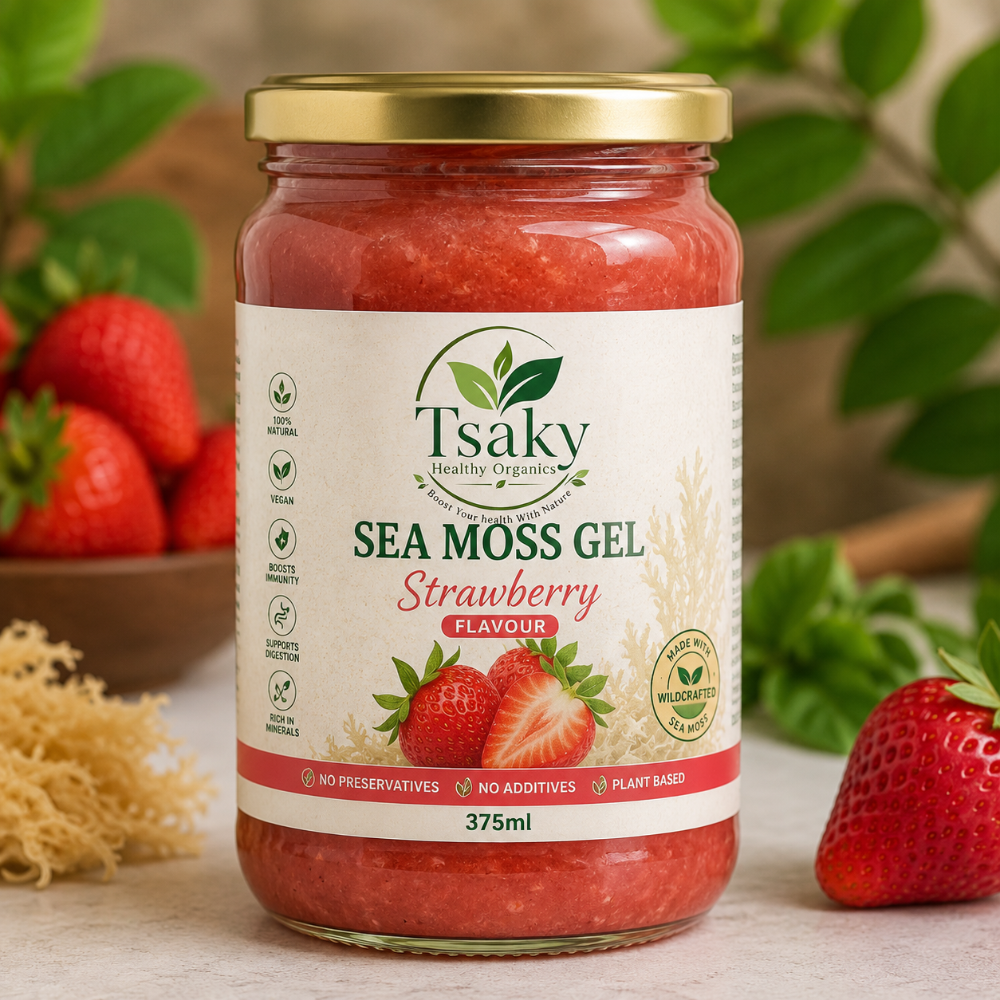

# Tsaky Healthy Organics - Premium Website

A luxurious, minimalist one-page website for Tsaky Healthy Organics, a South African natural wellness brand specializing in premium wildcrafted sea moss gel.

## 🎨 Design Features

- **Premium Aesthetic**: Clean, modern design inspired by AG1, Ritual, Apple, and Notion
- **Fully Responsive**: Optimized for desktop, tablet, and mobile devices
- **Smooth Animations**: Elegant fade-in animations on scroll
- **Interactive Elements**: FAQ accordion, mobile navigation, button ripple effects
- **WhatsApp Integration**: Direct ordering via WhatsApp with pre-filled messages
- **SEO Optimized**: Meta tags, semantic HTML, and fast loading

## 🎨 Brand Colors

- **Forest Green**: #0A5C36
- **Emerald Green**: #1F8A4D
- **White**: #FFFFFF
- **Light Cream**: #F9F8F4
- **Charcoal Black**: #1A1A1A
- **Gold**: #C9A227 (premium accents)

## 📁 Project Structure

```
tsaky/
├── index.html          # Main HTML file with all 13 sections
├── styles.css          # Premium CSS with responsive design
├── script.js           # JavaScript for animations and interactions
├── images/             # Image assets directory
│   ├── logo.png
│   ├── hero-product.png
│   ├── about-image.jpg
│   ├── founder.jpg
│   ├── lifestyle.jpg
│   ├── original.png
│   ├── strawberry.png
│   ├── mango.png
│   ├── pineapple.png
│   ├── blueberry.png
│   ├── mixed-berry.png
│   ├── orange.png
│   ├── green-apple.png
│   ├── watermelon.png
│   ├── peach.png
│   └── coconut.png
└── README.md
```

## 🚀 Sections

1. **Hero** - Eye-catching hero with product showcase and WhatsApp ordering
2. **About** - Company introduction and brand values
3. **Our Story** - Founder's inspiration and brand journey
4. **Meet the Founder** - Founder profile with quote and signature
5. **Product Benefits** - 20 benefit cards with icons
6. **Our Flavours** - 12 flavour cards with ordering options
7. **Why Choose Tsaky** - 10 feature cards highlighting brand strengths
8. **How to Enjoy** - 8 usage ideas with recommended daily intake
9. **Testimonials** - 3 customer review cards
10. **FAQ** - 6 accordion-style questions
11. **Call to Action** - Dark green luxury section with WhatsApp ordering
12. **Contact** - Phone, WhatsApp, email, location, and social media
13. **Footer** - Logo, navigation, and tagline

## 🛠️ Technologies Used

- **HTML5** - Semantic markup
- **CSS3** - Modern styling with CSS Grid, Flexbox, and animations
- **JavaScript (ES6+)** - Interactive features and smooth scrolling
- **Google Fonts** - Manrope font family
- **SVG Icons** - Inline SVG for optimal performance

## 📱 Key Features

### Mobile Navigation
- Hamburger menu with smooth animations
- Auto-close on link click
- Responsive design for all screen sizes

### Animations
- Fade-in on scroll using Intersection Observer
- Parallax effect in hero section
- Button ripple effects
- Smooth hover transitions

### WhatsApp Integration
All "Order Now" buttons link to:
- **Phone**: +27 64 813 0037
- **Message**: "Hello Tsaky Healthy Organics. I would like to order Sea Moss Gel."
- **URL**: https://wa.me/27648130037

### Image Placeholders
Clean, elegant placeholders with expected filenames for easy replacement:
- Circular placeholder for founder image
- Square placeholders for product images
- Dashed borders with icon indicators

## 🎯 Performance Optimizations

- Lightweight (no external dependencies except Google Fonts)
- Optimized CSS with CSS variables
- Debounced scroll events
- Lazy loading ready for images
- Minimal JavaScript footprint

## 🌐 Browser Support

- Chrome (latest)
- Firefox (latest)
- Safari (latest)
- Edge (latest)
- Mobile browsers (iOS Safari, Chrome Mobile)

## 📝 Setup Instructions

1. **Clone or download** the project files
2. **Add images** to the `images/` folder with the specified filenames
3. **Open** `index.html` in a web browser
4. **Customize** content as needed (contact info, social links, etc.)

## 🔧 Customization

### Update Contact Information
Edit the contact section in `index.html`:
- Phone number
- Email address
- Location
- Social media links

### Modify Colors
Update CSS variables in `styles.css`:
```css
:root {
    --forest-green: #0A5C36;
    --emerald-green: #1F8A4D;
    /* etc... */
}
```

### Add Real Images
Replace placeholder divs with actual images:
```html

```

## 📊 SEO Features

- Meta description and keywords
- Semantic HTML5 elements
- Alt text ready for images
- Fast loading time
- Mobile-friendly design
- Clean URL structure

## 🎨 Design Principles

- **Minimalism**: Clean, uncluttered layouts
- **Whitespace**: Generous spacing for premium feel
- **Typography**: Clear hierarchy with Manrope font
- **Color Psychology**: Greens for health/nature, gold for premium
- **Micro-interactions**: Subtle animations for engagement
- **Accessibility**: High contrast ratios and semantic markup

## 📞 Contact

**Tsaky Healthy Organics**
- Phone: +27 64 813 0037
- WhatsApp: +27 64 813 0037
- Email: info@tsaky.co.za
- Location: South Africa

## 📄 License

© 2024 Tsaky Healthy Organics. All rights reserved.

---

**Pure • Nutritious • Powerful**